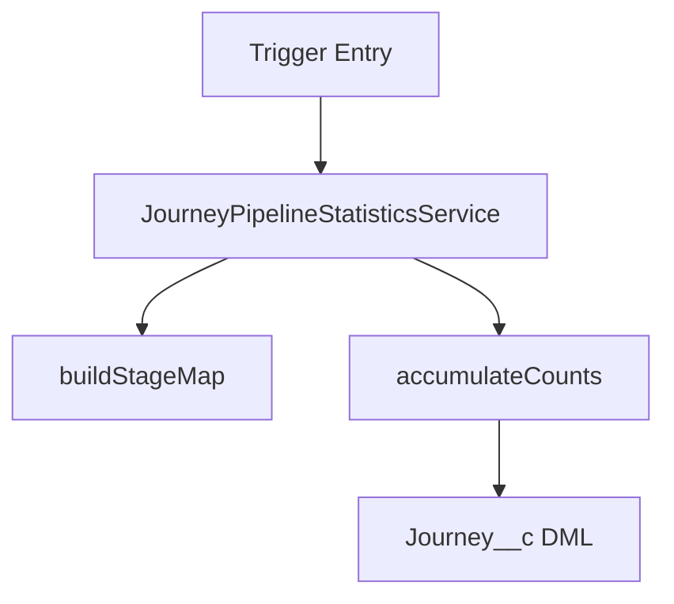

# Wiki Page Formatting Standards

This document defines the formatting standards for all Azure DevOps Wiki pages created by the autonomous ticket preparation workflow.

## Rich HTML Templates

Three wiki templates are available, each serving a different purpose:

| Template | Purpose | When to Use |
|----------|---------|-------------|
| `wiki-page-template.html` | Work item ticket preparation pages | Header contains "Autonomous Ticket Preparation" or page title starts with work item ID |
| `feature-solution-design-wiki.html` | Feature solution design pages | Header contains "Feature Solution Design" or work item type is Feature/Epic |
| `wiki-general-template.html` | Any wiki page (content-agnostic pattern reference) | Fallback — any page not matching the above patterns |

All templates share a unified design system:

### Visual Hierarchy

| Element | Design | Details |
|---------|--------|---------|
| **Page header** | Gradient bar | `border-radius: 8px; padding: 14px 16px;` — page title only, no links or metadata |
| **`##` section headers** | Markdown heading + **6px** gradient accent bar | Provides TOC detection + color-coded section identity |
| **`###` subsection headers** | Markdown heading + **4px** gradient accent bar | Lighter shade of parent section color for hierarchy |
| **Content** | White bordered cards | `background: #fff; border: 1px solid #dee2e6; border-radius: 8px; padding: 20px;` |
| **Callouts** | Colored left-border accent cards | `border-left: 4px solid ACCENT; border-radius: 0 8px 8px 0; padding: 14px;` |
| **Tables** | HTML styled (NOT markdown) | `#f8f9fa` header rows, `1px solid #dee2e6` borders, `padding: 10px` |
| **Status badges** | Colored spans | `padding: 2px 8px; border-radius: 3px; font-size: 11px;` |
| **Section sub-labels** | Bold colored text | `font-weight: 600; color: COLOR; border-bottom: 1px solid #dee2e6;` |
| **Diagrams** | Mermaid `graph TD` | Always top-down, never left-to-right |

### Color-Coded Sections

Colors are assigned by semantic meaning of each section heading:

- 🟢 **Green** (`#2e7d32 → #1b5e20`): Executive Summary
- 🔵 **Blue** (`#1565c0 → #0d47a1`): Page header, What — The Request (subsections: `#42a5f5 → #1565c0`)
- 🟣 **Purple** (`#7b1fa2 → #4a148c`): Why — Rationale & Evidence (subsections: `#ab47bc → #7b1fa2`)
- 🔷 **Indigo** (`#303f9f → #1a237e`): How — Solution & Validation → Solution Design (subsection: `#5c6bc0 → #303f9f`)
- 🩵 **Teal** (`#00796b → #004d40`): How — Solution & Validation → Quality & Validation

Colors are defined in `shared.json` → `wiki_sections`. Subsection accent bars use the lighter shade specified in each section's `color_from`/`color_to`.

### Critical Design Rules

- `[[_TOC_]]` MUST be on its own line outside any HTML block
- Section headers MUST use markdown `##` / `###` syntax for TOC detection
- HTML blocks must be separated by blank lines from markdown content
- Each HTML block is self-contained (no wrapping `<div>` around entire page)
- **NO** `<details>/<summary>` collapsed sections — all content must be fully visible
- **NO** markdown tables — always use HTML styled tables
- Mermaid diagrams always use `graph TD` (top-down), never `graph LR`

## Writing Tone & Narrative Style

### The Voice: Knowledgeable Guide

Write as a **knowledgeable colleague sharing insights** - someone who has thoroughly investigated the problem and wants to help readers understand both the journey and the destination. The tone should be:

- **Educational without being condescending** - Explain concepts as if teaching a capable peer who simply hasn't had time to research this specific topic yet
- **Narrative-driven** - Tell the story of discovery, not just list facts. Guide readers through "what we learned and why it matters"
- **Respectful of all audiences** - Business users should understand the value and impact; technical users should find the depth they need
- **Conversational but professional** - Use "we" to create partnership, avoid jargon without explanation, and maintain warmth without sacrificing precision

### Narrative Over Lists

**Bad Example (Just Facts):**
```markdown
## Research Findings
- Found ContactTriggerHandler
- Uses Handler Pattern
- 15 references in codebase
```

**Good Example (Narrative with Context):**
```markdown
## What We Discovered

When we examined the codebase, we found that the organization has already established a solid foundation for this type of work. The `ContactTriggerHandler` class follows the Handler Pattern that the team has standardized on - this is good news because it means we can extend existing patterns rather than introducing something unfamiliar.

We traced 15 references to this handler throughout the codebase, which tells us two important things: first, any changes here will need careful testing since the impact radius is significant; second, the pattern is well-established and trusted by the team.

| Component | What It Does | Why It Matters |
|-----------|--------------|----------------|
| ContactTriggerHandler | Orchestrates contact-related automation | Our entry point - we'll extend this rather than create something new |
```

### Balancing Business and Technical Audiences

Each section should work on two levels:

1. **Lead with business context** - Start with why this matters, what problem it solves, or what value it delivers
2. **Follow with technical depth** - Provide the specifics in tables, code references, or callout cards for those who need them

**Example Structure:**
```markdown
### Why We Chose This Approach

After evaluating our options, we determined that extending the existing Flow framework gives us the best balance of speed and maintainability. This approach means the team can deliver the feature within the sprint while keeping future enhancements straightforward.

For the technically curious, here's how the options compared:

<!-- All content is fully visible — no collapsed sections -->
<div style="background: #fff; border: 1px solid #dee2e6; border-radius: 8px; padding: 20px; margin-bottom: 20px; font-family: 'Segoe UI', sans-serif; font-size: 13px; color: #333;">
  <table style="width: 100%; border-collapse: collapse;">
    <tr style="background: #f8f9fa;">
      <td style="padding: 10px; font-weight: 600; border: 1px solid #dee2e6;">Option</td>
      <td style="padding: 10px; font-weight: 600; border: 1px solid #dee2e6;">Approach</td>
      <td style="padding: 10px; font-weight: 600; border: 1px solid #dee2e6;">Trade-offs</td>
    </tr>
    <tr>
      <td style="padding: 10px; border: 1px solid #dee2e6;">Option A</td>
      <td style="padding: 10px; border: 1px solid #dee2e6;">...</td>
      <td style="padding: 10px; border: 1px solid #dee2e6;">...</td>
    </tr>
  </table>
</div>
```

### Phrases to Use and Avoid

**Use:**
- "We discovered that..." / "Our investigation revealed..."
- "This matters because..." / "The key insight here is..."
- "Here's what this means in practice..."
- "For those interested in the details..." / "Diving deeper..."
- "The good news is..." / "One thing to watch for..."

**Avoid:**
- "Obviously..." / "Simply..." / "Just..." (condescending)
- "As everyone knows..." (assumes knowledge)
- "It should be noted that..." (bureaucratic)
- Unexplained acronyms on first use
- Technical jargon without context for business readers

## Azure DevOps Wiki-Specific Requirements

Azure DevOps Wiki uses a specific flavor of markdown with important differences from standard markdown:

### Critical ADO Wiki Rules

1. **HTML Support** - ADO Wiki DOES support HTML in wiki pages (unlike pull requests)
   - ✅ HTML tags allowed: `<div>`, `<strong>`, `<em>`, `<p>`, `<br/>`, `<span>`, `<table>`, `<tr>`, `<td>`, `<ul>`, `<ol>`, `<li>`
   - ❌ **Do NOT use** `<details>/<summary>` — all content must be fully visible
   - ⚠️ **Avoid hardcoded colors in markdown blocks** — use inline styles on HTML elements instead
   - ✅ Video embedding: `<video src="url" width=400 controls>`
   - ✅ Use HTML for styled content cards, tables, callouts, and accent bars

2. **Link Format** - Use standard markdown links, NOT wiki-specific syntax
   - ✅ `[Link Text](Page-Path)` - Standard markdown
   - ❌ `[[Link Text]]` - MediaWiki style (not supported)

3. **Tables** - Use HTML styled tables (NOT markdown) for consistent styling
   ```html
   <table style="width: 100%; border-collapse: collapse;">
     <tr style="background: #f8f9fa;">
       <td style="padding: 10px; font-weight: 600; border: 1px solid #dee2e6;">Header 1</td>
       <td style="padding: 10px; font-weight: 600; border: 1px solid #dee2e6;">Header 2</td>
     </tr>
     <tr>
       <td style="padding: 10px; border: 1px solid #dee2e6;">Value 1</td>
       <td style="padding: 10px; border: 1px solid #dee2e6;">Value 2</td>
     </tr>
   </table>
   ```

4. **Code Blocks** - Use lowercase language identifiers
   ```markdown
   ```apex
   // Apex code here
   ```
   ```

5. **Table of Contents** - Use ADO Wiki's automatic TOC
   ```markdown
   [[_TOC_]]
   ```

6. **Content Cards** - Wrap all prose and tables in white bordered cards
   ```html
   <div style="background: #fff; border: 1px solid #dee2e6; border-radius: 8px; padding: 20px; margin-bottom: 20px; font-family: 'Segoe UI', sans-serif; font-size: 13px; color: #333;">
     <p style="margin: 0; line-height: 1.7;">Content goes inside cards for clean presentation.</p>
   </div>
   ```

### Mermaid Diagrams
- Wrap diagrams with `::: mermaid` and close with `:::`.
- **Do NOT use `%%{init...}%%` or `classDef` styling.** These are not fully supported in ADO Wiki and break in Dark Mode.
- Use standard Mermaid node shapes to distinguish element types:
  - `([Start/End])` for terminators
  - `{{Decision}}` for logic checks
  - `[[Subprocess]]` for major actions
  - `[(Database)]` for storage
- Always use `graph TD` (top-down), never `graph LR` (avoid `flowchart`).
- Keep node labels concise.

#### Diagram Example
```markdown
::: mermaid
graph TD
  trigger([Trigger]) --> assess{{Decision}}
  assess -->|Yes| happy[Primary Path]
  assess -->|No| alternate[Fallback]
  happy --> done([Outcome])
  alternate --> notify[[Notify Stakeholders]]
  notify --> done
:::
```

> **Diagram cadence:** Provide at least one diagram in each major section (What, Why, How) to reinforce comprehension.

## Page Structure — What / Why / How

The wiki uses a scaffolded structure. Phase 01 publishes the full skeleton; subsequent phases fill in sections by replacing placeholder content between `<!-- SECTION:id -->` markers. Section IDs and metadata are defined in `shared.json` → `wiki_sections`.

```
Page Header (#work_item_id — title)
[[_TOC_]]
Status Banner (phase progress: ✅/⏳/⏸️)

## Executive Summary

## What — The Request
### Business Context
### Requirements & Scope
### Success Criteria

## Why — Rationale & Evidence
### Business Value & Impact
### Discovery & Research
### Investigation Trail
### Decision Rationale

## How — Solution & Validation
### Solution Design
### Quality & Validation

Footer (timestamp, attribution)
```

---

## 🎯 Executive Summary

[Begin with 2-3 sentences that tell the story: what's the situation, what did we discover, and what do we recommend? Write this as if explaining to a colleague over coffee.]

**The Challenge We're Addressing:**
[Describe the business problem in plain language. What pain point or opportunity prompted this work? Who is affected and how?]

**What We Learned:**
[Summarize the key discoveries from research. What surprised us? What confirmed our assumptions? What changed our thinking?]

**Our Recommended Approach:**
[Explain the solution in terms of value delivered, not technical implementation. What will be different when this is complete?]

**The Path Forward:**
[Set expectations: complexity level, key dependencies, and any important considerations for planning.]

> **Note:** This section is initially populated during Grooming (Phase 02b) with challenge + discoveries, then finalized during Solutioning (Phase 03b) with the recommended approach and path forward.

---

## 📋 What — The Request

### 🎯 Business Context

[Open with a narrative that puts the reader in the shoes of the people who need this. Who are they? What are they trying to accomplish? What's standing in their way?]

**The People This Affects:**
[Write about the stakeholders as real people with real challenges, not just "users." What does their day look like? What frustrates them about the current situation?]

**The Current Situation:**
[Describe where things stand today - not just technically, but in terms of the human experience. What works? What doesn't? Why is now the right time to address this?]

**What Success Looks Like:**
[Paint a picture of the future state in terms the stakeholders would use. How will their experience be different? What will they be able to do that they can't do today?]

### 📊 Requirements & Scope

[Transition into requirements with context: "Based on what we learned about the team's needs, here's what the solution must accomplish..."]

**Functional Requirements:**
[Frame these in terms of user value, not just technical capabilities. "Users need to be able to..." not just "System shall..."]

**Quality Attributes:**
[Explain why these matter: "Given the volume of records involved, performance is critical because..." not just "Response time < 2 seconds"]

**Out of Scope:**
[Explicitly call out what is NOT included in this work item to set clear boundaries.]

### 🏆 Success Criteria

[Link acceptance criteria to measurable outcomes. Each criterion should be testable and trace back to a business need.]

**Acceptance Criteria Scenarios:**
[List the AC scenarios from the groomed work item, framed in Given/When/Then or equivalent format.]

**Definition of Done:**
[Quality gates that must pass before this work is considered complete.]

---

## 💡 Why — Rationale & Evidence

### 📈 Business Value & Impact

[Explain why this work matters — not just what it does, but the strategic value it delivers.]

**Strategic Alignment:**
[How does this connect to organizational goals? What initiative or OKR does it support?]

**Stakeholder Impact:**
[Who benefits and how? What changes for them?]

**SWOT Summary:**
[If available, summarize strengths/weaknesses/opportunities/threats from the research synthesis.]

### � Discovery & Research

[Tell the story of what was discovered during technical research. What existing components, patterns, and documentation were found?]

**What We Found in Our Documentation:**
- [Relevant wiki pages and documentation found]
- [Prior solutions and approaches]
- [Design patterns and best practices]

**Technical Environment:**

| Type | Component Name | Impact Level | Notes |
|------|---------------|--------------|-------|
| [ApexClass/Flow/Trigger] | [Component Name] | [High/Medium/Low] | [Brief description] |

**Codebase Analysis:**

| Component | Purpose | Relevance | Reusability |
|-----------|---------|-----------|-------------|
| [Component 1] | [Function] | [How it relates] | [Can we reuse?] |

**External Dependencies:**
- [Third-party systems and APIs]
- [Service integrations required]

### 🔬 Investigation Trail

This section tells the story of how understanding evolved — not just what was found, but how findings built on each other.

**Where We Started:**
[Explain the initial questions or assumptions that guided the research.]

**How Our Understanding Evolved:**
[Describe how findings built on each other. Did anything surprise us?]

**Assumptions Tested:**

| What We Thought | Why We Thought It | What We Found | Verdict |
|-----------------|-------------------|---------------|---------|
| [Hypothesis] | [Source or reasoning] | [Evidence] | ✅ Confirmed / ❌ Refuted / ⚠️ Open |

**Confidence Assessment:**

| Area | Confidence | Evidence | Remaining Questions |
|------|-----------|----------|-------------------|
| [Technical approach] | High/Medium/Low | [What supports this] | [What's uncertain] |

### ⚖️ Decision Rationale

Every technical decision involves weighing alternatives. This section provides transparency on how options were evaluated.

**The Short Version:**
[One paragraph summary of why we chose what we chose — accessible to any reader]

**Options Evaluated:**

| Option | Approach | Strengths | Concerns | Assessment |
|--------|----------|-----------|----------|-----------|
| Option 1 | [Approach] | [Strengths] | [Concerns] | ✅ **Recommended** |
| Option 2 | [Approach] | [Strengths] | [Concerns] | ❌ Not this time |

**Standards That Guided Us:**

| Standard | Guidance | How It Applied |
|----------|---------|---------------|
| [Standard name] | [Rule] | [Impact on decision] |

**Trade-offs We're Making:**

| We're Choosing | Instead Of | Because | Risk Accepted |
|----------------|-----------|---------|--------------|
| [Choice] | [Alternative] | [Reasoning] | [Downside] |

---

## ✅ Quality & Validation

### 📋 How We'll Know We're Successful

**What Users Should Experience:**
1. [First user-facing requirement with acceptance test]
2. [Second user-facing requirement with acceptance test]
3. [Third user-facing requirement with acceptance test]

**What the System Must Do:**
4. [First technical requirement with validation approach]
5. [Second technical requirement with validation approach]
6. [Third technical requirement with validation approach]

### 🧪 Testing Strategy & Coverage

[Open with 2-3 paragraphs explaining the testing philosophy for this feature. What testing approach did we take and why? What categories of tests are most critical? What risks are we specifically testing against?]

**Our Testing Philosophy:**
[Explain the reasoning behind test case selection - what we prioritized and why. Help readers understand the coverage strategy.]

---

### 🎯 AC-Centric Test Coverage Matrix

This matrix ensures every Acceptance Criteria has both happy path AND unhappy path test coverage. No AC is considered fully covered without both.

| AC ID | Acceptance Criteria | Happy Path Tests | Unhappy Path Tests | Coverage Status |
|:-----:|---------------------|------------------|-------------------|:---------------:|
| AC-1 | [First acceptance criterion] | TC-001, TC-002 | TC-005, TC-006 | ✅ Full |
| AC-2 | [Second acceptance criterion] | TC-003 | TC-007 | ✅ Full |
| AC-3 | [Third acceptance criterion] | TC-004 | — | ⚠️ Partial |
| AC-4 | [Fourth acceptance criterion] | — | — | ❌ Gap |

> **Coverage Legend:**
> - ✅ **Full** = Has at least one Happy Path test AND one Unhappy Path test
> - ⚠️ **Partial** = Has only Happy Path OR only Unhappy Path tests (requires justification)
> - ❌ **Gap** = No test coverage (blocker - must be addressed)

**Path Type Definitions:**
| Path Type | Symbol | Description |
|-----------|:------:|-------------|
| Happy Path | ✓ | Validates AC works as expected under normal conditions with valid inputs |
| Negative | ✗ | Validates error handling, invalid inputs, permission failures, missing data |
| Edge Case | ⚡ | Validates boundary conditions, bulk operations, timing, concurrent access |
| Security | 🔒 | Validates access controls, data isolation, FLS/CRUD enforcement, sharing rules |

**Coverage Notes:**
- **AC-3 (Partial):** [Explanation of what's covered and what's not, and why - e.g., "No negative test because feature degrades gracefully with no user-facing error"]
- **AC-4 (Gap):** [Explanation of why no test exists and recommended action]

---

### 📊 Test Data Matrix

Understanding who and what we're testing is crucial. The test data matrix below defines the personas, configurations, and scenarios that form the foundation of our test coverage.

**Required Configuration:**
- [ ] [Feature flag or setting 1]
- [ ] [Feature flag or setting 2]
- [ ] [Required permission sets]

**Test Records to Create:**
- [ ] [Record type 1 with specific attributes]
- [ ] [Record type 2 with specific attributes]

**Environment Prerequisites:**
- [ ] [Integration or mock service setup]
- [ ] [Data seeding requirements]

#### 👤 Persona & Scenario Definitions

| Row ID | Persona | Profile / Permissions | Record Context | Key Conditions | Notes |
|:------:|---------|----------------------|----------------|----------------|-------|
| 👤 D1 | [Primary User Type] | [Profile + Permission Set] | [Object Context] | [Happy path conditions] | Primary success path |
| 👤 D2 | [Secondary User Type] | [Profile + Permission Set] | [Object Context] | [Alternate conditions] | Alternate flow |
| 📊 D3 | [Data Variation] | [Profile + Permission Set] | [Object Context] | [Boundary conditions] | Boundary testing |
| ⚠️ D4 | [Negative Scenario] | [Limited permissions] | [Object Context] | [Failure conditions] | Expected to fail gracefully |

> **Legend:** 👤 Persona-focused | 📊 Data variation | ⚠️ Negative/Edge case

#### 👤 D1: [Primary User Persona Name]

| Attribute | Value |
|-----------|-------|
| **Role/Title** | [e.g., Admissions Advisor] |
| **Profile** | [e.g., Admissions User] |
| **Permission Sets** | [e.g., Email_Composer_User, Template_Access] |
| **Record Access** | [e.g., Own records + sharing rules] |

**Test User Setup:**
```
Username: test.d1.user@sandbox.test
Profile: [Profile Name]
Permission Sets: [List]
Role: [Role in hierarchy]
```

**Required Test Records:**
| Object | Record Name | Key Field Values | Purpose |
|--------|-------------|------------------|---------|
| [Contact] | [Test Contact D1] | Email: test@example.com | Primary test record |
| [Account] | [Test Account D1] | Type: Prospect | Parent record |

**Feature Flag Configuration:**
| Flag Name | Value | Reason |
|-----------|-------|--------|
| [Feature_Enabled__c] | `true` | Standard happy path |

---

#### 👤 D2: [Secondary User Persona Name]

| Attribute | Value |
|-----------|-------|
| **Role/Title** | [e.g., Student Success Coach] |
| **Profile** | [e.g., Student Success User] |
| **Permission Sets** | [e.g., Email_Composer_User] |
| **Record Access** | [e.g., Team-based sharing] |

**Test User Setup:**
```
Username: test.d2.user@sandbox.test
Profile: [Profile Name]
Permission Sets: [List]
```

**Required Test Records:**
| Object | Record Name | Key Field Values | Purpose |
|--------|-------------|------------------|---------|
| [Lead] | [Test Lead D2] | Status: Open | Alternate object context |

---

#### 📊 D3: [Boundary/Data Variation Scenario]

| Attribute | Value |
|-----------|-------|
| **Scenario Type** | [e.g., Maximum record count] |
| **Data Condition** | [e.g., 200 related records] |
| **Expected Behavior** | [e.g., Pagination activates] |

**Test Data Requirements:**
| Object | Count | Key Attributes | Purpose |
|--------|-------|----------------|---------|
| [Related Object] | [200] | [Various statuses] | Bulk/boundary testing |

---

#### ⚠️ D4: [Negative/Error Scenario]

| Attribute | Value |
|-----------|-------|
| **Scenario Type** | [e.g., Permission denied] |
| **Failure Condition** | [e.g., Missing Create permission] |
| **Expected Behavior** | [e.g., Graceful error message] |

**Test User Setup:**
```
Username: test.d4.restricted@sandbox.test
Profile: Minimum Access User
Permission Sets: [None or limited]
```

**Why This Scenario Matters:**
[Explain the business risk if this error case isn't handled properly]

---

### 🔴 P1 Critical Path Tests

These tests validate the core functionality that must work for the feature to be considered successful. Failure of any P1 test is a release blocker.

| ID | Test Scenario | Path Type | Covers AC | Steps Summary | Expected Outcome | Data Row |
|----|---------------|:---------:|:---------:|---------------|------------------|:--------:|
| TC-001 | [Happy path scenario] | ✓ Happy | AC-1, AC-2 | [Key steps] | [Observable result] | D1 |
| TC-002 | [Critical negative path] | ✗ Negative | AC-1 | [Key steps] | [Observable result] | D2 |

#### TC-001: [Full Test Title]

| | |
|---|---|
| **Objective** | [What we're validating and what proves success - the "oracle" that determines pass/fail] |
| **Path Type** | ✓ Happy Path |
| **Covers AC** | AC-1, AC-2 |
| **Priority** | 🔴 P1 - Critical Path |
| **Data Row** | D1 |
| **Estimated Duration** | [X minutes] |

**Pre-conditions & Setup:**
- [ ] [User is logged in as specified persona]
- [ ] [Required records exist with specified attributes]
- [ ] [Feature flags are configured as specified]
- [ ] [Integration endpoints are available/mocked]

**Step-by-Step Execution:**

| Step | Action | Input/Data | Expected Result | ✓ |
|:----:|--------|------------|-----------------|:-:|
| 1 | [Navigate to specific location] | [URL or navigation path] | [Page/component loads successfully] | ☐ |
| 2 | [Perform specific action] | [Exact values to enter/select] | [Immediate visual feedback] | ☐ |
| 3 | [Verify intermediate state] | [What to look for] | [Expected intermediate result] | ☐ |
| 4 | [Complete the action] | [Final input or click] | [Success indicator appears] | ☐ |
| 5 | [Verify final outcome] | [Where to check] | [Expected final state] | ☐ |

**Verification Checklist:**
- [ ] **UI Verification:** [Specific UI element shows expected state]
- [ ] **Data Verification:** [Record field X = expected value]
- [ ] **Related Records:** [Child/related records created/updated as expected]
- [ ] **Notifications:** [Email/alert sent if applicable]

**Telemetry & Logs to Verify:**
| Log Type | What to Look For | Where to Find It |
|----------|------------------|------------------|
| [Debug Log] | [Specific log message or pattern] | [Developer Console / Debug Logs] |
| [Platform Event] | [Event name and payload] | [Event Monitoring] |
| [Custom Log] | [Nebula Logger entry] | [Log__c records] |

**Cleanup Steps:**
- [ ] [Delete test record created]
- [ ] [Reset any changed settings]

**👨‍💻 Developer Validation:**

**Unit Test Pattern:**
```apex
@IsTest
static void test_[Object]_[Action]_[Condition]_Success() {
    // Arrange
    [Setup test data matching D1 persona]
    
    // Act
    Test.startTest();
    [Execute the action being tested]
    Test.stopTest();
    
    // Assert
    System.assertEquals([expected], [actual], '[Descriptive message]');
}
```

**Assertions to Implement:**
- `System.assertEquals([expected_value], [actual_value], '[Field] should be [expected]');`
- `System.assertNotEquals(null, [record].Id, 'Record should be created');`
- `System.assertEquals([expected_count], [query_results].size(), 'Expected N records');`

**Mocks Required:**
- [ ] [External service mock - if applicable]
- [ ] [HTTP callout mock - if applicable]

**Integration Points to Verify:**
- [ ] [Trigger/Flow executed - check debug log for specific entry]
- [ ] [Platform Event published - verify subscriber received]

**🧪 QA Validation:**

**Step-by-Step Navigation:**
1. App Launcher → [App Name]
2. [Object] tab → [List View or New button]
3. [Specific page/component] → [Action to perform]

**Data Verification Query:**
```sql
SELECT Id, [Field1], [Field2], [Field3], CreatedDate
FROM [Object__c]
WHERE [Condition]
ORDER BY CreatedDate DESC
LIMIT 1
-- Expected: [Describe expected field values]
```

**Visual Verification Checkpoints:**
- [ ] [UI element 1] displays [expected state]
- [ ] [Toast/message] shows [expected text]
- [ ] [Record detail page] shows [expected field values]

**Environment Prerequisites:**
- [ ] Logged in as: [Username from D1]
- [ ] Feature flag `[Flag_Name__c]` = ON
- [ ] Permission set `[Permission_Set_Name]` assigned

---

#### TC-002: [Full Test Title - Negative Scenario]

| | |
|---|---|
| **Objective** | [What we're validating - error handling, graceful failure] |
| **Path Type** | ✗ Negative |
| **Covers AC** | AC-1 |
| **Priority** | 🔴 P1 - Critical Path |
| **Data Row** | D2 |
| **Estimated Duration** | [X minutes] |

**Pre-conditions & Setup:**
- [ ] [Required setup items]
- [ ] [Condition that triggers the negative path - e.g., missing permission]

**Step-by-Step Execution:**

| Step | Action | Input/Data | Expected Result | ✓ |
|:----:|--------|------------|-----------------|:-:|
| 1 | [Action that should trigger error] | [Invalid/missing input] | [Error is caught gracefully] | ☐ |
| 2 | [Verify error handling] | [Check error message/state] | [User-friendly error displayed] | ☐ |
| 3 | [Verify no data corruption] | [Check related records] | [No orphaned/partial records] | ☐ |

**Verification Checklist:**
- [ ] Error message is user-friendly and actionable
- [ ] No data corruption occurred
- [ ] User can recover from error state

**Cleanup Steps:**
- [ ] [Cleanup item - verify no orphaned records]

**👨‍💻 Developer Validation:**

**Unit Test Pattern:**
```apex
@IsTest
static void test_[Object]_[Action]_[ErrorCondition]_FailsGracefully() {
    // Arrange
    [Setup test data matching D2 persona - with error condition]
    
    // Act & Assert
    Test.startTest();
    try {
        [Execute the action that should fail]
        System.assert(false, 'Expected exception was not thrown');
    } catch ([ExpectedException] e) {
        System.assert(e.getMessage().contains('[expected message]'), 'Error message should be user-friendly');
    }
    Test.stopTest();
    
    // Verify no side effects
    System.assertEquals(0, [SELECT COUNT() FROM Object__c WHERE ...], 'No records should be created');
}
```

**Assertions to Implement:**
- Verify exception is thrown with correct message
- Verify no partial data was committed
- Verify error is logged appropriately

**Mocks Required:**
- [ ] [Mock to simulate failure condition if external dependency]

**🧪 QA Validation:**

**Step-by-Step Navigation:**
1. App Launcher → [App Name]
2. [Object] tab → [Action that triggers error]
3. [Observe error handling]

**Data Verification Query:**
```sql
SELECT COUNT()
FROM [Object__c]
WHERE CreatedDate = TODAY
-- Expected: No new records created (or count unchanged)
```

**Visual Verification Checkpoints:**
- [ ] Error toast/message displays [expected text]
- [ ] User is NOT redirected to broken page
- [ ] User can retry or navigate away

**Environment Prerequisites:**
- [ ] Logged in as: [Username from D2 - restricted user]
- [ ] Permission set `[Permission_Set_Name]` NOT assigned (to trigger error)

---

### 🟡 P2 Important Tests

These tests cover important alternate paths and key negative scenarios. They should pass before release but may not block deployment in exceptional circumstances.

| ID | Test Scenario | Path Type | Covers AC | Steps Summary | Expected Outcome | Data Row |
|----|---------------|:---------:|:---------:|---------------|------------------|:--------:|
| TC-003 | [Alternate scenario] | ⚡ Edge | AC-2 | [Key steps] | [Observable result] | D3 |
| TC-004 | [Negative scenario] | ✗ Negative | AC-3 | [Key steps] | [Observable result] | D4 |

#### TC-003: [Full Test Title - Edge Case]

| | |
|---|---|
| **Objective** | [What we're validating - specific alternate path or edge case] |
| **Path Type** | ⚡ Edge Case |
| **Covers AC** | AC-2 |
| **Priority** | 🟡 P2 - Important |
| **Data Row** | D3 |
| **Estimated Duration** | [X minutes] |

**Pre-conditions & Setup:**
- [ ] [Required setup items]
- [ ] [Specific data conditions for this scenario - e.g., bulk records, boundary values]

**Step-by-Step Execution:**

| Step | Action | Input/Data | Expected Result | ✓ |
|:----:|--------|------------|-----------------|:-:|
| 1 | [Action with edge condition] | [Boundary input] | [Expected handling] | ☐ |
| 2 | [Verify edge case handled] | [Check results] | [Expected outcome] | ☐ |
| 3 | [Verify no side effects] | [Check related data] | [No unexpected changes] | ☐ |

**Verification Checklist:**
- [ ] [Verification item 1]
- [ ] [Verification item 2]

**Cleanup Steps:**
- [ ] [Cleanup item]

**👨‍💻 Developer Validation:**

**Unit Test Pattern:**
```apex
@IsTest
static void test_[Object]_[Action]_[EdgeCondition]_HandlesCorrectly() {
    // Setup edge case data (e.g., bulk, boundary)
    // Execute and verify handling
}
```

**Key Assertions:** [List specific assertions for this edge case]

**🧪 QA Validation:**

**Navigation:** [Step-by-step to trigger edge case]
**Data Query:** `SELECT ... WHERE [edge condition]`
**Visual Check:** [What to verify in UI]

---

#### TC-004: [Full Test Title - Negative Scenario]

| | |
|---|---|
| **Objective** | [What we're validating - negative/error scenario] |
| **Path Type** | ✗ Negative |
| **Covers AC** | AC-3 |
| **Priority** | 🟡 P2 - Important |
| **Data Row** | D4 |
| **Estimated Duration** | [X minutes] |

**Pre-conditions & Setup:**
- [ ] [Setup that creates the negative condition]

**Step-by-Step Execution:**

| Step | Action | Input/Data | Expected Result | ✓ |
|:----:|--------|------------|-----------------|:-:|
| 1 | [Action that should fail gracefully] | [Invalid/edge input] | [Graceful error handling] | ☐ |
| 2 | [Verify error state] | [What to check] | [Expected error message/behavior] | ☐ |

**Verification Checklist:**
- [ ] Error message is user-friendly and actionable
- [ ] No data corruption occurred
- [ ] User can recover from error state

**Cleanup Steps:**
- [ ] [Cleanup item]

**👨‍💻 Developer Validation:**

**Unit Test Pattern:**
```apex
@IsTest
static void test_[Object]_[Action]_[NegativeCondition]_FailsGracefully() {
    // Setup negative condition
    // Verify exception or graceful handling
}
```

**Key Assertions:** [List specific assertions for error handling]

**🧪 QA Validation:**

**Navigation:** [Step-by-step to trigger negative scenario]
**Data Query:** `SELECT COUNT() FROM ... -- Expected: unchanged`
**Visual Check:** [Error message/state to verify]

---

### 🟢 P3 Additional Coverage

These tests provide additional coverage for edge cases and long-tail scenarios. They improve confidence but are not required for release.

| ID | Test Scenario | Path Type | Covers AC | Steps Summary | Expected Outcome | Data Row |
|----|---------------|:---------:|:---------:|---------------|------------------|:--------:|
| TC-005 | [Long-tail scenario] | 🔒 Security | AC-4 | [Key steps] | [Observable result] | D5 |

---

#### TC-005: [Full Test Title - Security/Long-tail]

| | |
|---|---|
| **Objective** | [What we're validating - long-tail or security scenario] |
| **Path Type** | 🔒 Security |
| **Covers AC** | AC-4 |
| **Priority** | 🟢 P3 - Nice to Have |
| **Data Row** | D5 |

**Pre-conditions & Setup:**
- [ ] [Required setup items]

**Step-by-Step Execution:**

| Step | Action | Input/Data | Expected Result | ✓ |
|:----:|--------|------------|-----------------|:-:|
| 1 | [Action] | [Input] | [Expected] | ☐ |
| 2 | [Action] | [Input] | [Expected] | ☐ |

**Verification Checklist:**
- [ ] [Verification item]

**👨‍💻 Developer Validation:**

**Unit Test Pattern:** [Brief pattern for this scenario]
**Key Assertions:** [List assertions]

**🧪 QA Validation:**

**Navigation:** [Steps]
**Data Query:** [Verification query]
**Visual Check:** [UI verification]

---

### � UAT Scripts

Business-friendly test scripts for stakeholder validation. These scripts use non-technical language and focus on observable business outcomes rather than system internals.

> 💡 **Audience:** These scripts are designed for business stakeholders who validate the feature meets their needs. They complement the technical QA test cases above.

#### UAT-001: [Business-Language Test Title]

| | |
|---|---|
| **Persona** | [Business role — e.g., Admissions Advisor] |
| **Covers AC** | AC-1, AC-2 |
| **Data Requirements** | [What records/users must exist before starting] |

**Test Steps:**

| Step | Action (Business Language) | What You Should See |
|:----:|---------------------------|---------------------|
| 1 | [Open the application and navigate to...] | [Page loads with expected content] |
| 2 | [Perform the business action...] | [Confirmation message or visual change] |
| 3 | [Verify the outcome by checking...] | [Expected business result] |

**Acceptance Decision:**
- ✅ **Pass if:** [All expected results observed — business stakeholder confirms feature works as intended]
- ❌ **Fail if:** [Any deviation from expected behavior — describe what would constitute failure]

---

#### UAT-002: [Second Business Test Title]

| | |
|---|---|
| **Persona** | [Different business role if applicable] |
| **Covers AC** | AC-3 |
| **Data Requirements** | [Preconditions in business terms] |

**Test Steps:**

| Step | Action (Business Language) | What You Should See |
|:----:|---------------------------|---------------------|
| 1 | [Business action] | [Expected observation] |
| 2 | [Verification action] | [Expected outcome] |

**Acceptance Decision:**
- ✅ **Pass if:** [Business criteria met]
- ❌ **Fail if:** [Business criteria not met]

---

### 🚀 Smoke Test Pack

Minimum post-deployment verification checklist. These checks confirm "the org is healthy after deployment" — they are intentionally shallow and fast.

> ⚠️ **Purpose:** Run these checks immediately after deployment to verify basic functionality. The full test suite (P1/P2/P3 above) provides comprehensive coverage.

| # | Check | What to Verify | Pass Criteria |
|:-:|-------|---------------|---------------|
| 1 | **Login + Navigation** | Core app loads, affected tabs/pages accessible | No errors, pages render, menus work |
| 2 | **Create Key Record** | Create/update records affected by the change | Record saves successfully, fields populated correctly |
| 3 | **Automation Sanity** | Routing, assignment, approval rules fire | Expected automation triggers, correct outcomes |
| 4 | **Integration Handshake** | External system queues, logging, event delivery | No errors in integration logs, events published/received |
| 5 | **Report/Dashboard** | Representative report loads (if applicable) | Data displays correctly, no timeouts |

**Smoke Pack Principles:**
- **Shallow** — confirms basic health, not full coverage
- **Fast** — entire pack completes in <15 minutes
- **Independent** — each check runs in any order
- **Repeatable** — same results on repeated execution

---

### 📋 Test Data Setup Guide

Step-by-step procedure for testers to prepare the test environment. This guide references the Test Data Matrix personas above and provides actionable setup instructions.

> **Purpose:** A tester should be able to follow these steps to create all required test data from scratch in a clean sandbox.

**Step 1: Create Test Users**

| # | Username | Profile | Permission Sets | Role | Purpose |
|:-:|----------|---------|----------------|------|---------|
| 1 | test.d1.user@sandbox.test | [Profile] | [Perm Set 1, Perm Set 2] | [Role] | Primary persona (D1) |
| 2 | test.d2.user@sandbox.test | [Profile] | [Perm Set 1] | [Role] | Secondary persona (D2) |
| 3 | test.d4.restricted@sandbox.test | Minimum Access | [None] | [None] | Negative testing (D4) |

**Step 2: Create Test Records**

| # | Object | Record Name | Key Field Values | Related To | Purpose |
|:-:|--------|-------------|------------------|------------|---------|
| 1 | [Account] | Test Account A | Type=Prospect | — | Parent record for D1 tests |
| 2 | [Contact] | Test Contact A | Email=test@example.com | Account A | Primary test subject |
| 3 | [Custom Object] | Test Record B | Status=Active, Type=Standard | Contact A | Child record scenario |

**Step 3: Configure Feature Flags / Settings**

| # | Setting | Object/Type | Value | Purpose |
|:-:|---------|-------------|-------|---------|
| 1 | [Feature_Enabled__c] | Custom Setting | `true` | Enable feature under test |
| 2 | [Queue Mapping] | Custom Metadata | [Values] | Required routing configuration |

**Step 4: Verify Environment**
- [ ] All test users can log in
- [ ] Required permission sets are assigned
- [ ] Test records are visible to appropriate users
- [ ] Feature flags are set correctly
- [ ] Integration endpoints are available (or mocked)

---

### 🔗 Requirements Traceability Matrix

This matrix provides a detailed view linking each acceptance criterion to its test cases, organized by path type. This supplements the AC-Centric Coverage Matrix above with additional detail.

| AC ID | Description | Happy Path Tests | Unhappy Path Tests | Coverage |
|:-----:|-------------|------------------|-------------------|:--------:|
| AC-1 | [First acceptance criterion] | TC-001 | TC-002 | ✅ Full |
| AC-2 | [Second acceptance criterion] | TC-001 | TC-003 | ✅ Full |
| AC-3 | [Third acceptance criterion] | TC-004 | — | ⚠️ Partial |
| AC-4 | [Fourth acceptance criterion] | — | TC-005 | ⚠️ Partial |

> **Coverage Legend:** 
> - ✅ **Full** = Has at least one Happy Path AND one Unhappy Path test
> - ⚠️ **Partial** = Missing either Happy Path or Unhappy Path coverage
> - ❌ **Gap** = No test coverage at all

**Coverage Notes:**
- **AC-3 (Partial):** [Explanation - e.g., "Missing negative test because error condition cannot occur in this context"]
- **AC-4 (Partial):** [Explanation - e.g., "Happy path covered by AC-1 tests; security test added for defense-in-depth"]

---

### 📝 Testing Notes & Considerations

**Automation Opportunities:**
- [Tests that are good candidates for automation]
- [Existing test frameworks that could be extended]

**Test Dependencies:**
- [Tests that must run in sequence]
- [Shared test data considerations]

**Environment Requirements:**
- [Sandbox configuration needs]
- [Integration endpoint requirements]

**How We'll Test This:**
- [Unit testing strategy and coverage goals]
- [Integration testing approach]
- [User acceptance testing plan]

**Quality Checkpoints:**
| Quality Aspect | What We'll Measure | How We'll Validate |
|----------------|-------------------|-------------------|
| [Performance] | [Response time requirements] | [Load testing approach] |
| [Security] | [Security requirements] | [Security testing approach] |
| [Usability] | [User experience goals] | [User testing approach] |

### ⚠️ Planning for Success

**Potential Challenges We've Considered:**
| Risk | How Likely | Impact | Our Plan |
|------|-----------|--------|----------|
| [Risk 1] | [High/Med/Low] | [High/Med/Low] | [How to address] |
| [Risk 2] | [High/Med/Low] | [High/Med/Low] | [How to address] |

**What We're Assuming:**
| Assumption | How Confident | How We'll Verify |
|------------|--------------|-----------------|
| [Assumption 1] | [High/Med/Low] | [How to verify] |
| [Assumption 2] | [High/Med/Low] | [How to verify] |

### 📋 Assumptions Resolution Log

This tracks all assumptions made during research and grooming, showing how each was validated, refuted, or remains open.

| Assumption | Phase Identified | Source | Status | Resolution Evidence |
|------------|-----------------|--------|--------|-------------------|
| [Initial assumption about system behavior] | Research | [ADO/Wiki/Code] | ✅ Validated | [What confirmed this assumption] |
| [Assumption about data model] | Research | [Metadata query] | ❌ Refuted | [What disproved this - corrected understanding] |
| [Assumption about stakeholder need] | Grooming | [Comment analysis] | ⚠️ Open | [Requires stakeholder confirmation - flagged as risk] |
| [Technical assumption] | Solutioning | [Code search] | ✅ Validated | [Evidence found in codebase] |

> **Status Legend:** ✅ Validated (confirmed true), ❌ Refuted (proved false), ⚠️ Open (needs verification), 🔄 Superseded (replaced by better understanding)

### 🔧 Quality Corrections Applied

During the autonomous preparation process, several quality gates identified and corrected issues:

#### Solution Bias Removed

Technical implementation details were moved from requirements to assumptions to maintain solution neutrality:

| Original Content | Where Found | Moved To | Category |
|-----------------|-------------|----------|----------|
| [Technical term like "LWC component"] | Description | Assumptions | solution_scent |
| [API name or specific technology] | Acceptance Criteria | Assumptions | solution_scent |
| [Database/field reference] | Requirements | Assumptions | implementation_detail |

#### Template Fidelity Corrections

| Issue Detected | Auto-Correction Applied | Section Affected |
|----------------|------------------------|------------------|
| [Missing standard section] | [Added required section from template] | [Section name] |
| [Non-compliant formatting] | [Reformatted to match standard] | [Section name] |

#### Logical Fallacies Challenged

| Fallacy Type | Original Statement | Challenge Question Added | Resolution |
|--------------|-------------------|-------------------------|------------|
| Appeal to Tradition | "We've always done it this way" | "Is this still the best approach given current capabilities?" | [How it was addressed] |
| False Dilemma | "We must use X or nothing" | "What other options exist that weren't considered?" | [Additional options identified] |
| Bandwagon | "Everyone uses this approach" | "Is this approach appropriate for our specific context?" | [Context-specific evaluation] |

> **Note:** Logical fallacy detection helps ensure decisions are based on sound reasoning rather than cognitive biases.

### ❓ Open Unknowns

These items could not be determined during autonomous preparation and require human input:

| Unknown | Why We Couldn't Determine | Impact if Unresolved | Suggested Resolution Path |
|---------|--------------------------|---------------------|--------------------------|
| [Specific unknown] | [What prevented determination] | [Risk level and affected areas] | [Who to ask or how to find out] |

---

## 📚 Additional Resources

- **Audit Trail:** Check the work item's Links tab for the child audit task with complete decision walkthrough
- **Work Item:** Return to the work item by checking your browser history or searching for work item #{{runtime.work_item_id}}
- **Related Documentation:** Check the work item's Links tab for related wiki pages and documentation

> **Note:** Direct URLs are not included in wiki pages to prevent link breakage. All related items and documentation are accessible via the work item's Links tab.

---

*📅 Last Updated: {{runtime.timestamp}}*  
*This single page provides complete documentation of research, decisions, and technical design.*

## 🎨 Section-Specific Formatting

### The Narrative-First Principle

Every section should **lead with narrative context** before presenting structured data. Tables and bullets are supporting evidence for the story, not the story itself.

**Pattern to Follow:**
1. **Opening narrative** (2-4 sentences) - Set context, explain why this matters
2. **Key insight callout** - The most important takeaway for skimmers
3. **Supporting detail** - Tables, lists, or callout cards for depth
4. **Transition** - Connect to what comes next

### What — The Request Sections
- **Lead with** who benefits and why this work matters to them
- **Support with** requirements tables and criteria lists
- **Tone:** Advocate for the user — "The team currently struggles with… and this impacts…"

### Why — Business Value & Discovery Sections
- **Lead with** what we learned and why it matters
- **Support with** tables for metadata/components found
- **Tone:** Curious colleague sharing discoveries — "When we dug into the codebase, we found something interesting…"

### Why — Investigation Trail Sections
- **Lead with** the narrative of how our understanding evolved
- **Support with** hypothesis tables (✅/❌/⚠️ outcomes)
- **Tone:** Research journal — "We started by asking… which led us to discover…"

### Why — Decision Rationale Sections
- **Lead with** the story of evaluation — what made this decision interesting
- **Support with** options comparison tables and callout cards for detail
- **Tone:** Transparent decision-maker — "We had three viable paths. Here's why we went with…"

### How — Solution Design Sections
- **Lead with** the "why" behind architectural choices
- **Support with** component tables and diagrams
- **Tone:** Experienced mentor — "We chose this approach because… here's how the pieces fit together…"

#### Solution Design Sub-sections (scale by complexity)

**🏗️ Architecture Overview** (always)
- 2-4 sentence narrative: what the solution does, why this approach, how pieces connect
- Reference the recommended option from why_decisions

**📦 Components** (always)
- Table: Component ID | Name | Type | Complexity | Responsibility
- For Complex components, add a "Key Methods" sub-table (see Method Design below)

**🔗 Integration Points** (always, when integration exists)
- Table: Source | Target | Mechanism | Contract
- Or narrative if only 1-2 simple integrations

**📋 Implementation Phases** (Medium + Complex)
- Table: Phase | Goal | Key Steps | Dependencies
- Mermaid `graph TD` showing phase dependency order (from `mermaid_diagrams` type=implementation_order)

**🗂️ Field-Level Mapping** (when solution modifies sObject fields)
- Group by operation with separate tables:
  - Fields Reset: API Name | Type | Before | After
  - Fields Computed: API Name | Type | Before | After
  - Fields Removed: API Name | Reason

**🗑️ Legacy Cleanup** (when replacing/heavily modifying existing code)
- Critical Issues table: Category | Description
- Dead Code Inventory table: Type (method/variable/map/class) | Name | Reason
- Summary: "What is NOT carried over and why"

**🔧 Method Design** (Complex components only)
- Table: Method | Visibility | Parameters | Return Type | CC Target | Nesting Limit | Pattern
- Include extracted helper methods
- Skip for Simple/Medium — responsibility field is sufficient

**📊 Diagrams** (always ≥1)
- Component interaction diagram (always) — shows entry point, helpers, data flow, external systems
- Implementation order diagram (Complex) — shows phase dependencies and parallel tracks
- Data flow diagram (optional) — shows transformation pipeline
- All diagrams from `mermaid_diagrams[]` in ticket-context.json

**🔗 AC ↔ Component Traceability** (always)
- Table: AC ID | Description | Component IDs
- Flag any gaps or orphans

### How — Quality & Validation Sections
- **Lead with** what success looks like in business terms
- **Support with** acceptance criteria, test coverage matrices, test cases
- **Tone:** Quality advocate — "We'll know this works when… and we've already addressed these concerns…"

### Bridging Business and Technical Audiences

| Audience | What They Need | How to Serve Them |
|----------|---------------|-------------------|
| Business Stakeholders | Value, impact, timelines | Lead every section with business context, avoid unexplained jargon |
| Technical Reviewers | Depth, specifics, rationale | Provide detail in callout cards and sub-label sections, reference standards explicitly |
| Future Maintainers | Context, reasoning, gotchas | Document "why" not just "what", flag areas of uncertainty |

## 🚨 Critical Rules

### NEVER Use
- ❌ MediaWiki links (`[[Page Name]]`)
- ❌ Uppercase language identifiers in code blocks
- ❌ Block-level blockquotes without `>` on each line
- ❌ Multiple separate pages
- ❌ Local file paths (`.ai-artifacts/`, `.github/`, `#file:`, `file://`)
- ❌ References to artifact files (`solution-output.json` or any internal section names)
- ❌ Timeline estimates, delivery dates, or sprint assignments
- ❌ Story point estimates or velocity-based planning

### ALWAYS Use
- ✅ Single comprehensive page
- ✅ Standard markdown links `[Text](URL)`
- ✅ Lowercase language identifiers (`apex`, `javascript`, `json`)
- ✅ `>` on each line for blockquotes
- ✅ Headers for section structure
- ✅ Tables with separator rows
- ✅ Automatic TOC `[[_TOC_]]`
- ✅ Embedded test cases (not external references)
- ✅ Inline test data definitions
- ✅ ADO work item IDs for cross-references

### HTML Usage Guidelines
- ✅ **Allowed:** `<div>`, `<span>`, `<strong>`, `<em>`, `<p>`, `<br/>`, `<table>`, `<tr>`, `<td>`, `<ul>`, `<ol>`, `<li>`
- ✅ **Rich styling:** Inline `style` attributes for content cards, accent bars, callouts, and status badges
- ✅ **Layout:** `<div>` with styling for content cards and visual elements
- ❌ **Do NOT use:** `<details>/<summary>` — all content must be fully visible
- ✅ Use markdown `##` / `###` for section headers (required for TOC detection)
- ✅ Use HTML for styled content cards, tables, callouts, and accent bars

## 🔍 Validation Checklist

Before creating the wiki page, verify:

**Structure & Format:**
- [ ] Header includes work item link and timestamp
- [ ] Work item link uses standard markdown format
- [ ] Emoji used consistently for headers
- [ ] Tables have header row and alignment row
- [ ] Code blocks use lowercase language identifiers
- [ ] Single page structure (no multiple pages)
- [ ] Automatic TOC `[[_TOC_]]` included
- [ ] All narrative sections represented
- [ ] Timestamps are ISO 8601 format
- [ ] Attribution is included
- [ ] HTML used sparingly and correctly (if any)
- [ ] No MediaWiki links `[[Page]]`
- [ ] All resource links are ADO or web URLs (no local file paths)

**Content Exclusion Rules (CRITICAL):**
- [ ] No local file paths (`.ai-artifacts/`, `.github/`, `#file:`, `file://`)
- [ ] No artifact file references (`solution-output.json` or any JSON file names)
- [ ] No timeline estimates or delivery dates
- [ ] No sprint assignments or velocity-based estimates
- [ ] No story point estimates (these belong in work items only)
- [ ] No implementation plans or step-by-step development guides
- [ ] All test case content embedded directly (not referenced externally)
- [ ] All test data definitions included inline (not in external files)

**Testing & Traceability:**
- [ ] Test Data Matrix includes all personas and scenarios
- [ ] Test cases organized by priority (P1 🔴, P2 🟡, P3 🟢)
- [ ] P1 tests include "Why This Test Matters" justification
- [ ] Traceability matrix links all acceptance criteria to test cases
- [ ] Coverage gaps are documented with explanations
- [ ] Test data setup guide is actionable and complete

**Reasoning & Documentation:**
- [ ] Investigation Trail section documents hypotheses tested
- [ ] Source conflicts are documented with resolution rationale
- [ ] Confidence levels assessed for key findings
- [ ] Decision Rationale section includes options comparison table
- [ ] Eliminated options have documented reasoning
- [ ] Standards that influenced decisions are explicitly cited
- [ ] Trade-offs are documented with clear justification
- [ ] Assumptions Resolution Log tracks all assumptions through lifecycle
- [ ] Quality Corrections section documents bias removal and auto-fixes
- [ ] Open unknowns are listed with resolution paths

**Tone & Quality:**
- [ ] Educational tone used throughout (teaching, not directive)
- [ ] Narrative flow from problem to solution
- [ ] "Why" is explained alongside "What" for all decisions

## 📯 Content Guidelines

### Section Organization (What / Why / How)
- **Executive Summary** — Problem statement + solution overview (partial at grooming, finalized at solutioning)
- **What — The Request** — Business context, requirements & scope, success criteria
- **Why — Rationale & Evidence** — Business value, discovery & research, investigation trail, decision rationale
- **How — Solution & Validation** — Solution design, quality & validation (test cases, coverage matrix, test data)

### Navigation
- Table of contents at top for easy navigation
- Section headers with emoji for visual hierarchy
- Links to ADO work item throughout
- No cross-page navigation (single page design)

### Data Presentation
- Use tables for structured data with educational headers
- Use code blocks for examples and API calls
- Use lists for findings and recommendations
- Use consistent educational tone across sections
- Progressive disclosure from simple to complex

## 📋 Callout Boxes

Use blockquotes for important notes (no HTML, use markdown bold):

```markdown
> ⚠️ **Important:** This assumption requires validation with the Banner integration team before implementation.

> 💡 **Key Insight:** Existing ContactTriggerHandler already has similar filtering logic that can be reused.

> 🚨 **Risk:** Performance degradation possible if filter criteria return >2000 records.
```

**Note:** Each line of a multi-line blockquote needs its own `>` prefix in ADO Wiki.

## Page Footer Template

Every page must end with this footer (wrapped in `<!-- SECTION:footer -->` markers):

```markdown
---

📅 **Last Updated:** [ISO 8601 timestamp]
Documentation generated by AI-assisted workflow.
```

## Example: Well-Formatted Wiki Page

```markdown
<!-- Page header gradient bar with work item ID + title -->

[[_TOC_]]

<!-- Status Banner -->
📊 **Grooming** ✅ | **Research** ✅ | **Solutioning** ✅ | **Testing** ✅

---

## 🎯 Executive Summary

**The Challenge:** Users need to filter Contacts by status and affiliation to improve data quality and user experience.

**What We Learned:** Existing ContactTriggerHandler already has filtering logic we can extend.

**Our Approach:** Build a reusable filtering component leveraging existing patterns with performance optimization.

**The Path Forward:** Moderate complexity with reusable components for future projects.

---

## 📋 What — The Request

### 🎯 Business Context

Student Services advisors currently export contacts to Excel for filtering — a time-consuming process that delays enrollment outreach. With enrollment season approaching, improving data quality by 40% is critical.

### 📊 Requirements & Scope

- Filter contacts by status with instant results
- Save filter preferences for future sessions
- Export filtered data to CSV format

### 🏆 Success Criteria

AC scenarios traced to quality gates and definition of done.

---

## � Why — Rationale & Evidence

### � Business Value & Impact

Strategic alignment with enrollment efficiency initiative. Reduces manual effort for 15+ advisors.

### 🔍 Discovery & Research

- Prior filtering implementations in Student module
- Reusable status picker component available
- Integration with Banner system for data sync

### 🔬 Investigation Trail

Assumptions tested: ContactTriggerHandler supports extension (✅ Confirmed). Confidence: High.

### ⚖️ Decision Rationale

Chose to extend existing Apex + LWC patterns over building net-new. TEA score: 8.5/10.

---

## 🛠️ How — Solution & Validation

### 🏛️ Solution Design

The solution replaces the legacy `JourneyPipelineStatisticsService` with a streamlined, single-pass Apex service. We chose to rebuild rather than patch because the existing implementation has 6 critical issues including dead code paths, stale statistics, and CC > 30 methods.

#### 📦 Components

| ID | Name | Type | Complexity | Responsibility |
|----|------|------|------------|----------------|
| C1 | JourneyPipelineStatisticsService | Apex Service | Complex | Orchestrate pipeline statistics calculation via single SOQL + map-based accumulation |
| C2 | JourneyPipelineStatsBatch | Batch Apex | Medium | Nightly recalculation for large data volumes |

#### 📋 Implementation Phases

| Phase | Goal | Key Steps | Dependencies |
|-------|------|-----------|--------------|
| P1 | Core refactor | Replace nested loops with map accumulation, extract helpers | None |
| P2 | Field cleanup | Reset stale fields, remove dead code | P1 |
| P3 | Batch support | Add batch wrapper for nightly runs | P1 |

#### 🔧 Method Design (C1 — Complex)

| Method | Visibility | CC Target | Pattern |
|--------|-----------|-----------|---------|
| `calculate()` | public | ≤ 8 | Guard clause + map accumulation |
| `buildStageMap()` | private | ≤ 4 | Map factory with null-safe defaults |

#### 📊 Diagrams



### ✅ Quality & Validation

P1/P2/P3 test cases, AC coverage matrix, UAT scripts, smoke pack — all embedded.

---

📅 **Last Updated:** 2025-10-31T14:30:00Z
```


## Common Formatting Mistakes to Avoid

❌ **DON'T:**
- Use `[[Wiki Links]]` format - use standard markdown `[text](path)` instead
- Forget blank lines before lists
- Use uppercase language identifiers in code blocks (use `apex` not `Apex`)
- Use unencoded ampersands in URLs (use `&amp;`)
- Include raw URLs without link text
- Mix emoji styles inconsistently
- Create orphan pages with no navigation
- Use absolute wiki paths (use relative)
- Leave placeholder text like [TODO] or [TBD]
- Use spaces in wiki paths (use hyphens or URL-encode)
- Overuse HTML when markdown would work better
- **Include direct URLs to work items or wiki pages** - they break easily
- **Reference local file paths** (`.ai-artifacts/`, `.github/`, `#file:`)
- **Include timeline or sprint estimates** - these belong in work items
- **Include implementation plans or step-by-step guides** - focus on design, not how to build
- **Reference artifact files** (`solution-output.json` or any JSON file names)
- **Leave test cases as external references** - embed them directly

✅ **DO:**
- Prefer markdown, use HTML sparingly for special effects
- Add blank line before every list
- Use lowercase language identifiers: `apex`, `javascript`, `python`
- Apply emoji standards consistently
- Provide clear navigation paths
- Include generation timestamps
- Fill all placeholders before saving
- Test blockquotes render correctly (use `>` per line)
- Use `[[_TOC_]]` for automatic table of contents
- Use content cards, callout cards, and accent bars for visual hierarchy
- **Direct users to check Links tab** instead of including direct URLs
- **Reference work item numbers** (e.g., "#12345") instead of full URLs
- **Embed all test cases and test data directly in the wiki**
- **Include full traceability matrix linking AC to test cases**
- **Use visual priority indicators** (🔴 P1, 🟡 P2, 🟢 P3) for test cases
